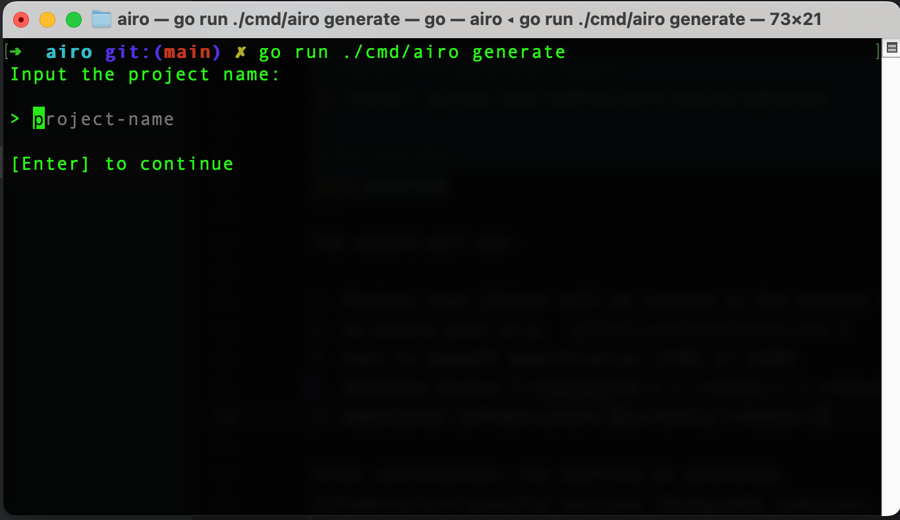
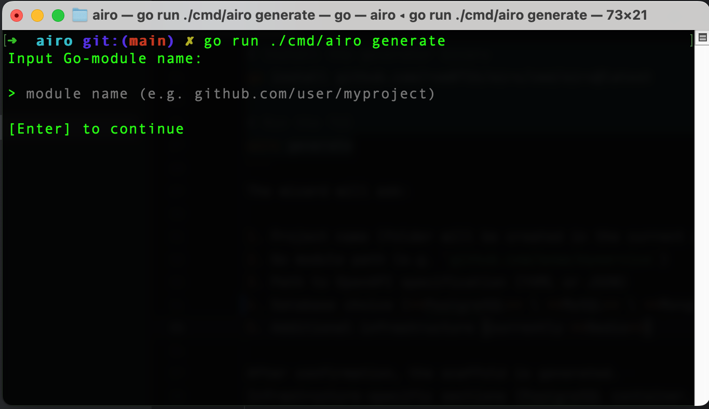
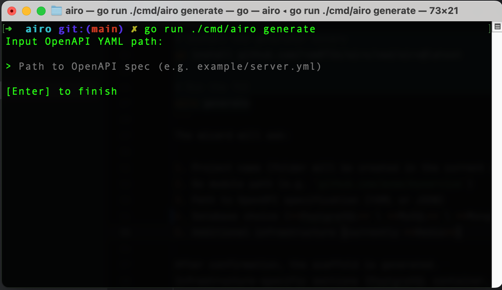
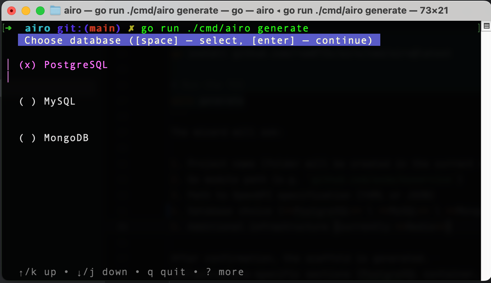
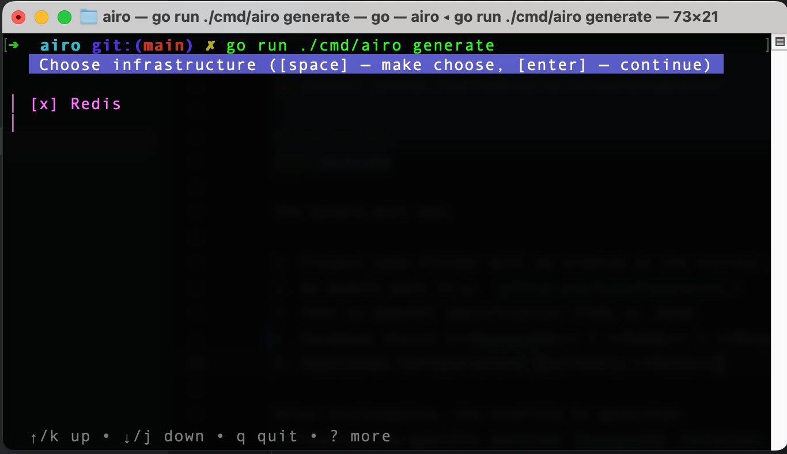
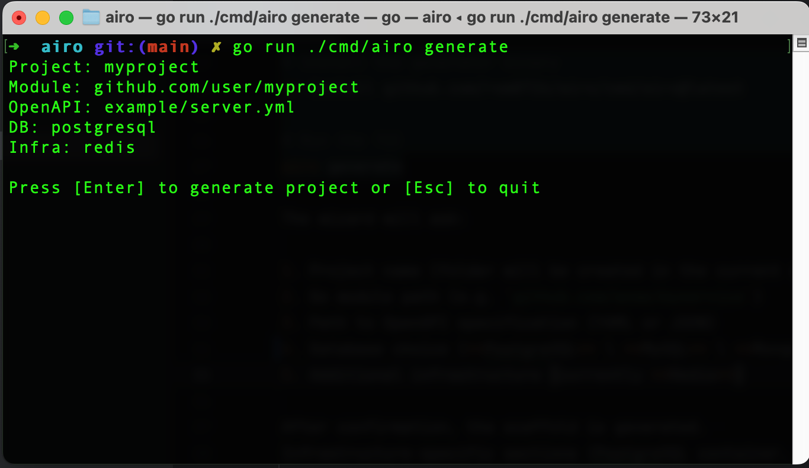

# airo

Spec-first Golang project scaffold generator

## Key features
- **OpenAPI first** – start with a spec, everything else is generated around it.
- **Code generation with [ogen-go/ogen]** – generation of request/response models & router.
- **Dependency injection via [rom8726/di]** – constructor-based DI.
- **Batteries included**
  - PostgreSQL integration
  - MySQL integration
  - MongoDB integration
  - Redis integration (optional)
  - Kafka integration (optional)
  - Health-check, Prometheus metrics, pprof endpoints
  - Structured logging with slog
- **Docker-ready** – `Dockerfile`, `docker-compose.yml`, `Makefile` are scaffolded for you.
- **Static analysis out of the box** – `.golangci.yml` with commonly used linters.
- **CLI powered by [spf13/cobra]**
- **12-factor config** – environment variables parsed with `envconfig`, `.env` supported.

## Quick start
```bash
# Install the generator binary
go install github.com/rom8726/airo/cmd/airo@latest

# Run the TUI
airo generate
```
The wizard will ask:

1. Project name (folder will be created in the current directory)
2. Go module path (e.g. `github.com/acme/myservice`)
3. Path to OpenAPI specification (YAML or JSON)
4. Database choice (**PostgreSQL** \ **MySQL** \ **MongoDB**)
5. Additional infrastructure (**Redis** \ **Kafka**)

Screenshots:













After confirmation, the scaffold is generated.  
Infrastructure-specific sections (PostgreSQL container, Redis container, volumes, healthchecks, etc.) are automatically injected into `docker-compose.yml`.

### Minimal OpenAPI example
If you don’t have a spec yet, start with the included template `example/server.yml` or something like this:
```yaml
openapi: 3.1.0
info:
  title: Example API
  version: 1.0.0
paths:
  /ping:
    get:
      summary: Ping-pong endpoint
      operationId: ping
      responses:
        '200':
          description: pong
          content:
            text/plain:
              schema:
                type: string
```
## Generated layout
```
myservice/
├── cmd/
│   └── server/             # server command
├── internal/
│   ├── api/
│   │   └── rest/           # your handlers (interfaces generated by ogen)
│   ├── generated/          # ogen output (do not edit)
│   ├── config/             # env-config structs & helpers
│   └── app.go              # app, db, redis, etc.
├── pkg/                    # reusable packages
├── dev/
│   ├── docker-compose.yml  # app + selected infra (PostgreSQL, Redis…)
│   ├── compose.env.example # config file example for docker compose environment
│   ├── config.env.example  # config file example for local environment
│   └── dev.mk              # Makefile commands for operate docker compose
├── main.go
├── .golangci.yml           # linter configuration
├── Dockerfile              # multi-stage build (scratch runtime)
├── Makefile                # common targets: build, run, test, lint, etc.
└── go.mod
```
## Running the generated service

### 1. With Go directly
Create/adjust `.env` (or pass variables directly):
```dotenv
API_SERVER_ADDR=:8080
TECH_SERVER_ADDR=:9090

POSTGRES_USER=postgres
POSTGRES_PASSWORD=secret
POSTGRES_HOST=localhost:5432
POSTGRES_DATABASE=mydb

REDIS_HOST=localhost
REDIS_PORT=6379
REDIS_DB=0
```

```bash
cd myservice
go run ./cmd/server --env-file=.env
```
### 2. Using Make & Docker
Most repetitive commands are wrapped into make targets:
```bash
# Build the binary for your host
make build

# Run unit tests & linters
make test          # go test ./...
make lint          # golangci-lint run

# Build container image and start entire stack
make dev-up    # equivalent to: docker compose up
```
`make dev-up` relies on the generated `docker-compose.yml`.  
Only the services you selected in the wizard will be present (e.g. if you skipped Redis, the file will contain only the app + PostgreSQL).

Stop and clean resources:
```bash
make dev-down  # docker compose down
```
## Available endpoints

- `GET :8080/ping` – from your OpenAPI spec
- `GET :8081/health` – liveness probe
- `GET :8081/metrics` – Prometheus metrics
- `GET :8081/debug/pprof/*` – pprof profiles

---

Apache-2.0 License
